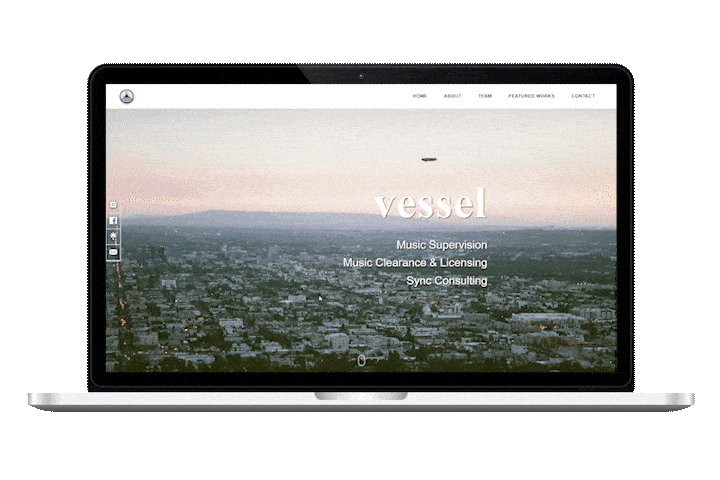

# Vessel Music Services' Portfolio Website 🖳

### A Single-Page Scroller Portfolio Site with All the Important Information



#### Inspired by [Dopefolio](https://github.com/rammcodes/Dopefolio) by [Ram Maheshwari](https://github.com/rammcodes)

The original single-page HTML template was converted to **React**, in order to ease upscaling and ease the incorporation of using JavaScript.

#### Tech Stack and Other Tools Used:

- React.JS and JSX
- SASS (SCSS)
- Google API (so that VMS can edit the entries on the site)
- [emailjs](https://www.emailjs.com/)

#### Check out the final product [here](https://vesselsound.com/)

---

#### To run the repository locally, clone the repository and then run these commands in your terminal

```bash
npm install

npm run dev
```

Then navigate to the correct port in localhost on your browser.